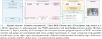

# OccuSG

OccuSG is the implementation of `Occupancy-Grounded Room Segmentation for Hierarchical 3D Scene Graphs` a ROS 2 Humble workspace for occupancy-based room/region grounding and scene graph generation. The pipeline combines depth-to-point-cloud projection, OctoMap occupancy integration, 3D-to-2D free-space projection, incremental DuDe region decomposition, YOLO/ONNX semantic perception, and `scene_graph_core` / `scene_graph_ros` graph construction, with Matterport3D bag launch and evaluation scripts included in this repository.




## Paper and citation

```bibtex
@misc{occusg2026,
  title = {OccuSG},
  author = {...},
  year = {2026},
  note = {Citation information to be updated}
}
```

Some included components have their own citations. See `src/mapconversion/README.md` for the free-space projection / map conversion paper and `src/incremental_dude_ros2/incremental_dude_ros2/Third_Party/dude_final/README` for the original DuDe citation.

## Installation

This repository is laid out as a ROS 2 workspace root:

```text
OccuSG/
  .devcontainer/
  overrides/
  src/
    point_cloud_generator/
    scene_graph_core/
    scene_graph_ros/
    semantic_perception/
    incremental_dude_ros2/
    mapconversion/
    octomap_mapping/
```

Workspace packages:

| Package | Role |
|---|---|
| `point_cloud_generator` | Converts synchronized depth images and camera info into `sensor_msgs/PointCloud2`. |
| `semantic_perception` | Runs YOLO segmentation through ONNX Runtime and publishes 3D detections. |
| `octomap_server` / `octomap_mapping` | Builds and publishes OctoMap occupancy maps from point clouds. |
| `mapconversion` / `mapconversion_msgs` | Projects 3D voxel/OctoMap data into 2D occupancy and height/slope maps. |
| `incremental_dude_ros2` / `incremental_dude_msgs` | Decomposes 2D occupancy into stable regions and publishes `/dude/regions`. |
| `scene_graph_core` | Provides the Python scene graph data structures, services, and JSON serialization. |
| `scene_graph_ros` | Orchestrates ROS inputs, managers, visualization, JSON export, launch files, and evaluation/profiling scripts. |

### Requirements

- Ubuntu 22.04, as used by `.devcontainer/humble.Dockerfile`
- ROS 2 Humble, colcon, rosdep, and the ROS dependencies declared in the package manifests
- C++17 compiler and CMake
- Python 3 with `numpy`, `scipy`, `networkx`, and `shapely` for the scene graph and evaluation scripts
- OpenCV, PCL, Eigen, CGAL, fmt, glog, yaml-cpp, Boost, OctoMap, and ROS message/filter/TF dependencies used by the C++ packages
- ONNX Runtime 1.19.2 under `/opt/onnxruntime-linux-x64-1.19.2` for CPU builds or `/opt/onnxruntime-linux-x64-gpu-1.19.2` for GPU builds, unless `ONNXRUNTIME_DIR` is set manually
- For GPU inference: CUDA-capable NVIDIA driver/runtime, ONNX Runtime with `CUDAExecutionProvider`, and the build flag `-DONNXRUNTIME_USE_GPU=ON`

The docker container installs CUDA 12.4.1, ROS Humble desktop, ONNX Runtime, PyTorch CUDA wheels, TensorRT Python packages, and common development tools.

### Docker

Docker support is provided through the devcontainer files:

- `.devcontainer/humble.Dockerfile`
- `.devcontainer/docker-compose-humble.yml`
- `.devcontainer/devcontainer.json`

The compose service is named `dev`, builds the image `occusg:latest`, runs with `network_mode: host`, reserves all NVIDIA GPUs, mounts host `src/` into `/workspace/occusg_ws/src`, host `bags/` into `/workspace/occusg_ws/bags`, and host `models/` into `/workspace/occusg_ws/models`. The Docker build argument `USE_GPU` defaults to `ON` and is also exposed inside the container as `USE_GPU`.

Host requirements for the GPU container are Docker with Compose support, an NVIDIA driver compatible with CUDA 12.4, and the NVIDIA Container Toolkit. The Docker image itself is based on `nvidia/cuda:12.4.1-cudnn-runtime-ubuntu22.04`.

Enable X11 access before launching the container if you want RViz or other GUI tools:

```bash
sudo xhost +local:docker
```

Build and start the development container from the repository root. You can then attach VS Code to the running container.

```bash
docker compose -f .devcontainer/docker-compose-humble.yml up -d --build
docker compose -f .devcontainer/docker-compose-humble.yml exec dev bash
```

Alternatively, open the repository in VS Code and select Reopen in Container to build and attach VS Code directly to the development environment.

To build the same container with CPU ONNX Runtime selected, pass `USE_GPU=OFF`:

```bash
USE_GPU=OFF docker compose -f .devcontainer/docker-compose-humble.yml up -d --build
```

To manually build the workspace from inside the container, run:

```bash
cd /workspace/occusg_ws
source /opt/ros/humble/setup.bash
rosdep install --from-paths src --ignore-src -r -y
colcon build --symlink-install \
  --cmake-args \
    -DONNXRUNTIME_USE_GPU=${USE_GPU:-ON} \
    -DONNXRUNTIME_DIR=/opt/onnxruntime-current \
    -DCMAKE_EXPORT_COMPILE_COMMANDS=ON
source install/setup.bash
```

In Docker, `USE_GPU=ON` selects `/opt/onnxruntime-linux-x64-gpu-1.19.2` through the fixed `/opt/onnxruntime-current` symlink, and `USE_GPU=OFF` selects `/opt/onnxruntime-linux-x64-1.19.2`. Pass the same value to CMake as `ONNXRUNTIME_USE_GPU`; runtime inference is controlled by the `semantic_node` ROS parameter `use_gpu`.

### Manual installation

Manual installation has not been tested in this repository. The repository itself is a workspace root, so clone it as the workspace:

```bash
git clone --recursive git@github.com:crcz25/OccuSG.git ~/occusg_ws
cd ~/occusg_ws
source /opt/ros/humble/setup.bash
rosdep install --from-paths src --ignore-src -r -y
colcon build --symlink-install \
  --cmake-args -DONNXRUNTIME_USE_GPU=ON -DCMAKE_EXPORT_COMPILE_COMMANDS=ON
source install/setup.bash
```

For CPU-only semantic perception, use the CPU ONNX Runtime tree and leave GPU support off:

```bash
colcon build --symlink-install \
  --cmake-args -DONNXRUNTIME_USE_GPU=OFF -DCMAKE_EXPORT_COMPILE_COMMANDS=ON
```

If ONNX Runtime is installed somewhere else, pass it explicitly:

```bash
colcon build --symlink-install \
  --cmake-args \
    -DONNXRUNTIME_USE_GPU=ON \
    -DONNXRUNTIME_DIR=/path/to/onnxruntime-linux-x64-gpu-1.19.2 \
    -DCMAKE_EXPORT_COMPILE_COMMANDS=ON
```

`semantic_perception` declares a runtime ROS parameter named `use_gpu`. When the package is built without `-DONNXRUNTIME_USE_GPU=ON`, the node logs a warning and forces CPU inference even if `use_gpu:=true` is configured.

## Usage

### Matterport3D Dataset

The MP3D bags can be accessed from this pCloud link: <https://e.pcloud.link/publink/show?code=kZmQKrZbsoxdOHzsdjd9Xn2OOqUBJA8LbKX>.

When using Docker, place each downloaded bag directory under the repository's `bags/` directory on the host. This directory is mounted into the container at `/workspace/occusg_ws/bags`, so a host bag at `bags/<scan_id>` is available inside Docker as `/workspace/occusg_ws/bags/<scan_id>`.

The ONNX semantic segmentation model is available from the same pCloud link as the bags. Place the model files under the repository's `models/` directory on the host, similar to the bag data. This directory is mounted into the container at `/workspace/occusg_ws/models`, and the default parameter files expect `models/yolo26x-seg.onnx` and `models/coco.names`.

The main Matterport3D bag entry point is:

```bash
ros2 launch scene_graph_ros scene_graph_pipeline_mp3d_bag.launch.py \
  bag_path:=/path/to/mp3d/bags \
  scan_id:=<scan_id>
```

The launch file expects the bag directory to exist at:

```text
<bag_path>/<scan_id>
```

It starts:

- `ros2 bag play <bag_path>/<scan_id> --clock`
- `point_cloud_generator/depth_to_pointcloud`
- `octomap_server/octomap_server_node`
- `mapconversion/map_conversion_oct_node`
- `semantic_perception/semantic_perception`
- `incremental_dude_ros2/inc_dude`
- `scene_graph_ros/scene_graph_region`
- `rviz2`, when `use_rviz:=true`

Launch arguments:

| Argument | Default | Purpose |
|---|---|---|
| `bag_path` | required | Directory containing MP3D bag folders. |
| `scan_id` | required | MP3D bag folder/name under `bag_path`. |
| `params_file` | `scene_graph_ros/config/scene_graph_pipeline_params_mp3d.yaml` | Shared ROS parameter YAML for the pipeline. |
| `inc_dude_params_file` | `incremental_dude_ros2/config/inc_dude_params.yaml` | Parameter YAML for incremental DuDe. |
| `rviz_config` | `scene_graph_ros/config/rviz_mp3d_bag.rviz` | RViz config file. |
| `use_rviz` | `true` | Start RViz2. |
| `use_sim_time` | `true` | Use `/clock` from `ros2 bag play --clock`. |
| `region_map_topic` | `/mapUAV` | Occupancy grid topic consumed by `incremental_dude_ros2`. |
| `stable_regions_topic` | `/dude/regions` | Stable region topic consumed by `scene_graph_region`. |
| `enable_profiling` | `false` | Enable runtime profiling JSON output for nodes that implement the profiling parameters. |
| `profiling_output_path` | `<bag_path>/<scan_id>/profiling` | Directory for profiling JSON files. |
| `profiling_run_name` | `<scan_id>_region` | Prefix for profiling files. |
| `profiling_save_on_shutdown` | `true` | Save profiling files on node shutdown. |
| `profiling_discard_first_n` | `5` | Warmup samples discarded from profiling summaries. |

Example with profiling and no RViz:

```bash
ros2 launch scene_graph_ros scene_graph_pipeline_mp3d_bag.launch.py \
  bag_path:=/workspace/occusg_ws/bags \
  scan_id:=17DRP5sb8fy \
  use_rviz:=false \
  enable_profiling:=true
```

The launch file remaps or overrides the MP3D bag topics to `/rgb`, `/depth`, `/depth/camera_info`, `/odom`, `/pointcloud`, `octomap_full`, `/mapUAV`, and `/dude/regions`. If your bag uses different names, adapt the launch file or parameter YAML.

### TurtleBot3 Gazebo Simulator

The pipeline can also be run against the TurtleBot3 simulator in Gazebo. Start Gazebo first from a TurtleBot3 workspace, then launch the OccuSG TurtleBot3 pipeline from the OccuSG workspace.

Example with the hospital world:

```bash
ros2 launch turtlebot3_gazebo turtlebot3_world.launch.py \
  world:=/home/devuser/gazebo_assets/worlds/hospital/hospital.world \
  x_pose:=0 \
  y_pose:=14 \
  gui:=true
```

In a second terminal:

```bash
cd /workspace/occusg_ws
source install/setup.bash
ros2 launch scene_graph_ros scene_graph_pipeline.tbot3.launch.py
```

Known Gazebo world directories under `/home/devuser/gazebo_assets/worlds/` are listed below. These maps are available but have not all been tested with the OccuSG pipeline.

```text
bookstore/
dynamic_obstacle/
dynamic_world/
empty_room/
experiment_rooms/
factory/
hospital/
office/
random_world/
room_with_walls_1/
room_with_walls_2/
small_house/
star_room_with_walls/
turtlebot3_world/
```

The TurtleBot3 simulator publishes the camera, depth, odometry, TF, and robot state topics consumed by the pipeline. A typical topic list is:

```text
/clock
/cmd_vel
/imu
/intel_realsense_r200_depth/camera_info
/intel_realsense_r200_depth/depth/camera_info
/intel_realsense_r200_depth/depth/image_raw
/intel_realsense_r200_depth/image_raw
/intel_realsense_r200_depth/points
/intel_realsense_r200_rgb/camera_info
/intel_realsense_r200_rgb/image_raw
/joint_states
/odom
/parameter_events
/performance_metrics
/robot_description
/rosout
/tf
/tf_static
```

### Outputs

For the Matterport3D bag launch, the scene graph JSON export path is set in the launch file to:

```text
<bag_path>/<scan_id>/scene_graph.json
```

The JSON export happens on shutdown when `export_json_on_shutdown` is true. If `export_json_path` points to a directory or has no file suffix, `scene_graph_ros/json_export.py` writes `scene_graph.json` inside that directory.

With `enable_profiling:=true`, profiling output defaults to:

```text
<bag_path>/<scan_id>/profiling/
```

## Evaluation scripts

Evaluation scripts live in `src/scene_graph_ros/scripts`. The OccuSG scripts are standalone Python tools; they do not launch ROS nodes.

### Metric scripts

Evaluate predicted object nodes against Matterport3D `.house` object records:

```bash
python3 src/scene_graph_ros/scripts/evaluate_mp3d_objects.py \
  --graph_json /path/to/results/<scan_id>/scene_graph.json \
  --scan_root /path/to/mp3d/dataset/v1/scans/<scan_id> \
  --scan_id <scan_id> \
  --output_csv /path/to/evals/object_eval_matches.csv \
  --output_json /path/to/evals/object_eval_summary.json
```

The script reports `percent_found`, `percent_correct`, and average matched-object position error. If output paths are provided, the scan id is inserted into the filenames, for example `object_eval_summary_<scan_id>.json`.

Evaluate predicted room/region footprints against Matterport3D region records:

```bash
python3 src/scene_graph_ros/scripts/evaluate_mp3d_regions.py \
  --scan_id <scan_id> \
  --dsg_dir /path/to/results/<scan_id> \
  --mp3d_root /path/to/mp3d/dataset/v1/scans \
  --output_dir /path/to/evals \
  --auto_align
```

The region evaluator locates `scene_graph.json` under `--dsg_dir`, reads Matterport3D `house_segmentations` data from `--mp3d_root/<scan_id>`, and writes:

```text
region_eval_summary_<scan_id>.csv
region_eval_summary_<scan_id>.json
region_eval_pairwise_<scan_id>.csv
region_eval_pairwise_<scan_id>.json
```

Aggregate existing OccuSG MP3D object and region evaluation outputs:

```bash
python3 src/scene_graph_ros/scripts/collect_mp3d_eval_tables.py \
  --scans_root /path/to/eval/scans_root \
  --output_dir /path/to/eval/tables \
  --verbose
```

By default, the collector looks for object model result directories named `y11` and `y26`, and for region results under `regions`. It writes:

```text
object_detection_results.csv
region_segmentation_results.csv
region_segmentation_dataset_summary.csv
```

Hydra comparison scripts are also present:

```bash
python3 src/scene_graph_ros/scripts/evaluate_hydra_mp3d_objects.py \
  --scan_id <scan_id> \
  --hydra_dir /path/to/hydra/results \
  --mp3d_root /path/to/mp3d/dataset/v1/scans \
  --output_dir /path/to/hydra/evals

python3 src/scene_graph_ros/scripts/evaluate_hydra_mp3d_regions.py \
  --scan_id <scan_id> \
  --hydra_dir /path/to/hydra/results \
  --mp3d_root /path/to/mp3d/dataset/v1/scans \
  --output_dir /path/to/hydra/evals \
  --auto_align

python3 src/scene_graph_ros/scripts/collect_hydra_mp3d_eval_tables.py \
  --results_dir /path/to/hydra/evals \
  --output_dir /path/to/hydra/tables \
  --verbose
```

The Hydra object evaluator writes `object_eval_matches_<scan_id>.csv` and `object_eval_summary_<scan_id>.json`. The Hydra region evaluator writes the same region summary and pairwise filenames as the OccuSG region evaluator. The Hydra collector writes the same table filenames as `collect_mp3d_eval_tables.py`.

`run_all_region_evals.sh` contains hard-coded local paths under `/home/crcz/repos/...`; treat it as a local batch helper rather than a portable user-facing entry point.

### Profiling

By default, profiling files are written to:

```text
<bag_path>/<scan_id>/profiling/
```

Current profiling implementations in this repository emit:

```text
<scan_id>_region.point_cloud_generator.json
<scan_id>_region.incremental_dude.json
<scan_id>_region.scene_graph_region.json
```

The launch file also forwards profiling parameters to `octomap_server` and `mapconversion`, but the checked-in `src/octomap_mapping` and `src/mapconversion` code does not currently implement these profiling parameters or emit profiling JSON files.

Each profiling file stores raw stage samples in milliseconds plus summary statistics after discarding the first `profiling_discard_first_n` warmup samples. Timings are callback execution times measured with monotonic wall-clock timers, not end-to-end message latency.

To aggregate all profiled scans under a bag/result directory:

```bash
src/scene_graph_ros/scripts/aggregate_runtime_profiles.py \
  /workspace/occusg_ws/mp3d/results
```

For a single scan, pass the profiling directory and run name:

```bash
src/scene_graph_ros/scripts/aggregate_runtime_profiles.py \
  /workspace/occusg_ws/mp3d/results/<scan_id>/profiling \
  <scan_id>_region
```

The aggregator writes these files to the input directory, or to `--output-dir` when provided:

```text
runtime_summary.json
runtime_summary.csv
```

The runtime table has rows for point-cloud generation, 3D occupancy integration, 2D free-space projection, DuDe decomposition, region tracking, entity assignment and graph assembly, and total per update. Rows whose stages are not present in the discovered profiling files are left empty with notes.
