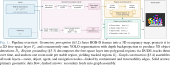

# OccuSG

OccuSG is a ROS 2 Humble workspace for occupancy-grounded room segmentation and
hierarchical 3D scene graphs. The intended pipeline combines RGB-D perception,
point-cloud generation, occupancy mapping, room decomposition, and scene-graph
construction.



## Paper and citation

```bibtex
@misc{occusg2026,
      title={Occupancy-Grounded Room Segmentation for Hierarchical 3D Scene Graphs},
      author={Carlos Cueto Zumaya and Iacopo Catalano and Jorge Peña-Queralta and Wallace Moreira Bessa},
      year={2026},
      eprint={2606.13727},
      archivePrefix={arXiv},
      primaryClass={cs.RO},
      url={https://arxiv.org/abs/2606.13727},
}
```

## Current workspace contents

`colcon list` currently discovers these seven packages:

| Package | Build type | Role |
|---|---|---|
| `incremental_dude_msgs` | `ament_cmake` | Region interface messages. |
| `incremental_dude_ros2` | `ament_cmake` | Incremental DuDe room decomposition. |
| `point_cloud_generator` | `ament_python` | Synchronized depth-to-point-cloud projection. |
| `scene_graph_core` | `ament_python` | Scene-graph data structures and algorithms. |
| `scene_graph_ros` | `ament_python` | ROS orchestration, visualization, export, and evaluation utilities. |
| `semantic_perception_msgs` | `ament_cmake` | RGB-D object-proposal interfaces. |
| `semantic_perception` | `ament_python` | GroundingDINO, MobileSAM, and OpenCLIP inference. |

`src/mapconversion/` and `src/octomap_mapping/` are Git submodules; populate them
with `git submodule update --init --recursive` before building the full pipeline.

`scene_graph_ros` consumes object perception exclusively through
`semantic_perception_msgs/ObjectProposal3DArray` published by
`semantic_perception`. There is no other object-detection path in the workspace.

## Dependency model

Use Ubuntu 22.04, Python 3.10, and ROS 2 Humble. Dependencies are intentionally
split between the operating system and one Python virtual environment.

### System and ROS dependencies

Install ROS, compiler, interface, and native C++ dependencies with apt/rosdep.
Do not install ROS packages such as `rclpy` or `cv_bridge` from pip.

Required system components include:

- ROS 2 Humble desktop, `ros-dev-tools`, Colcon, and rosdep;
- a C++17 compiler, CMake, Git, and Python's venv support;
- OpenCV development libraries for `incremental_dude_ros2`;
- CGAL, GMP, and MPFR for the DuDe implementation;
- the ROS packages declared in each `package.xml`.

After configuring the official ROS 2 apt repository, a typical base install is:

```bash
sudo apt-get update
sudo apt-get install -y \
  ros-humble-desktop \
  ros-dev-tools \
  build-essential \
  cmake \
  git \
  python3-venv \
  libcgal-dev \
  libgmp-dev \
  libmpfr-dev \
  libopencv-dev
```

The build script initializes rosdep when necessary and installs dependencies
declared by the package manifests. To do this manually:

```bash
source /opt/ros/humble/setup.bash
sudo rosdep init       # once per machine; skip if already initialized
rosdep update --include-eol-distros
rosdep install --from-paths src --ignore-src -r -y
```

### Python inference environment

Torch, torchvision, OpenCLIP, GroundingDINO, MobileSAM, Transformers, and their
Python image-processing dependencies are pinned in
[`src/semantic_perception/requirements.txt`](src/semantic_perception/requirements.txt).
They must be installed in the venv, not globally.

The default environment location is `$HOME/venv`, matching the devcontainer:

```bash
cd /path/to/occusg_ws
src/semantic_perception/scripts/create_inference_env.sh
source "$HOME/venv/bin/activate"
```

To use another location, set `VENV_PATH` consistently:

```bash
VENV_PATH="$PWD/.venv" \
  src/semantic_perception/scripts/create_inference_env.sh
source "$PWD/.venv/bin/activate"
```

The venv is created with `--system-site-packages`. This is required so the venv
interpreter can import apt-installed ROS modules while keeping the large
inference stack isolated.

## Build the complete workspace

### One-command build

From a clean terminal, after the system/ROS prerequisites above are installed:

```bash
cd /path/to/occusg_ws
./scripts/build_workspace.sh
```

The script:

1. sources `/opt/ros/${ROS_DISTRO:-humble}/setup.bash`;
2. creates `${VENV_PATH:-$HOME/venv}` if it does not exist;
3. verifies that the venv imports both `rclpy` and Torch;
4. installs declared apt/ROS dependencies through rosdep;
5. runs `pip check`;
6. builds every discovered package with the venv's Python.

After it completes, source the workspace in the terminal where ROS commands will
run:

```bash
source install/setup.bash
```

Useful environment overrides are:

```bash
# Use an existing environment at a custom location.
VENV_PATH="$PWD/.venv" ./scripts/build_workspace.sh

# Skip rosdep on repeated/offline builds after system dependencies are installed.
SKIP_ROSDEP=1 ./scripts/build_workspace.sh

# Forward additional arguments to `colcon build`.
SKIP_ROSDEP=1 ./scripts/build_workspace.sh --executor sequential
```

### Equivalent manual build

The critical detail is invoking Colcon through the venv interpreter. Activating
the venv and then running `/usr/bin/colcon` is not equivalent: it can generate
ROS Python entry points with a `#!/usr/bin/python3` shebang, which cannot import
Torch.

```bash
cd /path/to/occusg_ws
source /opt/ros/humble/setup.bash
source "${VENV_PATH:-$HOME/venv}/bin/activate"

rosdep install --from-paths src --ignore-src -r -y
python -m pip check
python -m colcon build \
  --symlink-install \
  --cmake-args -DCMAKE_EXPORT_COMPILE_COMMANDS=ON

source install/setup.bash
```

## Build only `semantic_perception`

On a fresh workspace, build the message dependency and package together:

```bash
cd /path/to/occusg_ws
source /opt/ros/humble/setup.bash
source "${VENV_PATH:-$HOME/venv}/bin/activate"

python -m colcon build \
  --symlink-install \
  --packages-up-to semantic_perception
source install/setup.bash
```

For subsequent code-only rebuilds after `semantic_perception_msgs` is installed:

```bash
python -m colcon build \
  --symlink-install \
  --packages-select semantic_perception
source install/setup.bash
```

Verify that the generated executable uses the venv:

```bash
head -1 install/semantic_perception/lib/semantic_perception/semantic_perception_node
```

The first line must point to `${VENV_PATH:-$HOME/venv}/bin/python`. If an older
build points to `/usr/bin/python3`, remove only
`build/semantic_perception` and `install/semantic_perception`, then rebuild with
`python -m colcon` as shown above.

## Docker/devcontainer

The development image is based on
`nvidia/cuda:12.8.1-cudnn-devel-ubuntu22.04`. It installs ROS Humble, native
build dependencies, and `/home/devuser/venv` from the same pinned semantic
requirements. The repository is mounted at `/workspace/occusg_ws`.

```bash
docker compose -f .devcontainer/docker-compose-humble.yml up -d --build
docker compose -f .devcontainer/docker-compose-humble.yml exec dev bash
```

The container entrypoint runs the same venv-aware workspace build script. The
compose file reserves NVIDIA GPUs, so Docker GPU use requires a compatible host
driver and the NVIDIA Container Toolkit. The image uses PyTorch 2.7.1 with the
CUDA 12.8 wheel, covering RTX 3090/Ampere (`sm_86`) and RTX 50-series/Blackwell
(`sm_120`) GPUs.

## ONNX Runtime and GPU selection

The current source tree has no ONNX Runtime consumer and no CMake target reads
`ONNXRUNTIME_DIR` or `ONNXRUNTIME_USE_GPU`. Those dependencies and build flags
were removed from the documented and container build process.

The former YOLO/ONNX `semantic_node` parameter block (`model_file`, `class_file`,
`use_gpu`, `conf_thresh`, `iou_thresh`, `cluster_*`) has been removed from
`scene_graph_ros/config/scene_graph_pipeline_params*.yaml`. Those files now carry
a `semantic_perception:` block instead. Do not pass `use_gpu` to the current node.

Current device selection is:

- ROS node: `device` and `devices` parameters in the `semantic_perception:` block
  of `src/semantic_perception/config/semantic_perception.yaml` or of the
  `scene_graph_ros` pipeline parameter files;
- standalone runner: `--device` and `--openclip-device`;
- Docker GPU exposure: NVIDIA Container Toolkit and Compose device reservation.

## Current launch and runtime entry points

The supported semantic launch command has one launch argument, `config`:

```bash
source install/setup.bash
ros2 launch semantic_perception semantic_perception.launch.py \
  config:=/absolute/path/to/semantic_perception.yaml
```

The model files are runtime assets and are not required to compile the workspace.
See [`src/semantic_perception/README.md`](src/semantic_perception/README.md) for
model names, standalone validation, ROS parameters, rosbag testing, debug images,
and CPU/GPU guidance.

The full scene-graph pipeline (perception, mapping, region decomposition, and
graph construction) runs from a recorded MP3D bag with:

```bash
source /opt/ros/humble/setup.bash
source "${VENV_PATH:-$HOME/venv}/bin/activate"
source install/setup.bash

ros2 launch scene_graph_ros scene_graph_pipeline_mp3d_bag.launch.py \
  bag_path:=$PWD/bags scan_id:=2t7WUuJeko7 use_rviz:=false
```

The scene graph is exported to `<bag_path>/<scan_id>/scene_graph.json` on
shutdown. `scene_graph_pipeline.tbot3.launch.py` is the equivalent entry point
for the TurtleBot3 simulation topics.

### Perception parameters

`semantic_perception` prompts Grounding DINO with the HM3D vocabulary and
projects object geometry into the graph frame itself:

| Parameter | Default | Meaning |
|---|---|---|
| `class_labels_path` | `models/labels/HM3D_CountsOfObjectTypes.csv` | Class vocabulary; drives prompts, `class_name`, and the cached CLIP text embeddings. |
| `detector_vocabulary_size` | `64` | Leading vocabulary labels used for detection prompts; `0` uses all 1624. |
| `detector_prompt_batch_size` | `16` | Labels per Grounding DINO caption. |
| `detector_merge_iou_threshold` | `0.7` | IoU above which boxes from different prompt batches are merged. |
| `target_frame` | `odom` | Graph frame the geometry is projected into, at the image timestamp. |
| `tf_timeout_sec` | `0.2` | TF lookup timeout for that transform. |
| `publish_projection_diagnostics` | `false` | Per-frame projection trace at DEBUG level. |

Detection cost scales linearly with `detector_vocabulary_size`: measured on an
RTX 5070 Ti at 640x480, 64 labels is 4 captions and ~0.89 s of detection per
frame, 128 labels is 8 captions and ~1.38 s. The full 1624-label vocabulary would
need 102 captions per frame (~17 s), which is not usable online.

`fused_embedding` is `normalize(concat(mask_embedding, bbox_embedding,
label_embedding))`. Each component is a unit-norm CLIP vector of dimension `D`
(768 for ViT-L-14), so the fused vector has dimension `3D` = 2304. The mask
embedding uses the SAM mask on a black background; the bbox embedding uses the
unmasked detector crop; the label embedding is looked up from a cache built once
at startup and never re-encoded per frame.

### Object association parameters

`scene_graph_region` finds OBJECT nodes near an incoming proposal and then
decides:

| Parameter | Default | Meaning |
|---|---|---|
| `object_proposals_topic` | `/semantic_perception/object_proposals` | `ObjectProposal3DArray` input. |
| `proposals_qos_*` | `keep_last`/`reliable`/`volatile`/`10` | QoS for that subscription. |
| `object_spatial_association_distance` | `0.75` | Candidate search radius, in metres. |
| `object_semantic_similarity_threshold` | `0.70` | Minimum cosine similarity between the proposal `fused_embedding` and a node's `object_embedding`. |
| `object_position_update_policy` | `running_mean` | `running_mean` averages associated observations; `latest` keeps the newest. |
| `object_room_boundary_tolerance` | `0.10` | Metres an object position may lie outside a DuDe region polygon and still join that room. |

- No nearby node -> create one.
- Nearby nodes, best cosine at or above the threshold -> update that node.
- Nearby nodes but none similar enough -> the detection is **spatially ambiguous**
  and no node is created. Semantic disagreement is never treated as evidence that
  a second physical object occupies the same place.

Each OBJECT node keeps `object_embedding` as `normalize(embedding_sum / count)`
over its valid `fused_embedding` observations, plus separate
`detection_observation_count` and `embedding_observation_count`, accumulated
`class_evidence`, and a canonical `class_name` recomputed from that evidence.

Room membership uses only the object's own position and the DuDe region polygons:
strict containment first, then the nearest boundary within
`object_room_boundary_tolerance`, otherwise unassigned. It is re-evaluated when
the object moves and whenever Incremental DUDE publishes new region geometry.

The exported JSON uses schema version `2.0`. See
[`src/scene_graph_core/README.md`](src/scene_graph_core/README.md) for the object
node schema.

## Tests

Run the standalone semantic tests inside the inference venv:

```bash
source "${VENV_PATH:-$HOME/venv}/bin/activate"
PYTHONPATH=src/semantic_perception \
  python -m pytest -q src/semantic_perception/test
```

Run Colcon tests for the built workspace with:

```bash
source /opt/ros/humble/setup.bash
source "${VENV_PATH:-$HOME/venv}/bin/activate"
source install/setup.bash
python -m colcon test
python -m colcon test-result --verbose
```

Evaluation and profiling utilities remain under `src/scene_graph_ros/scripts/`.
Use each script's `--help` output for its current standalone command-line API.
